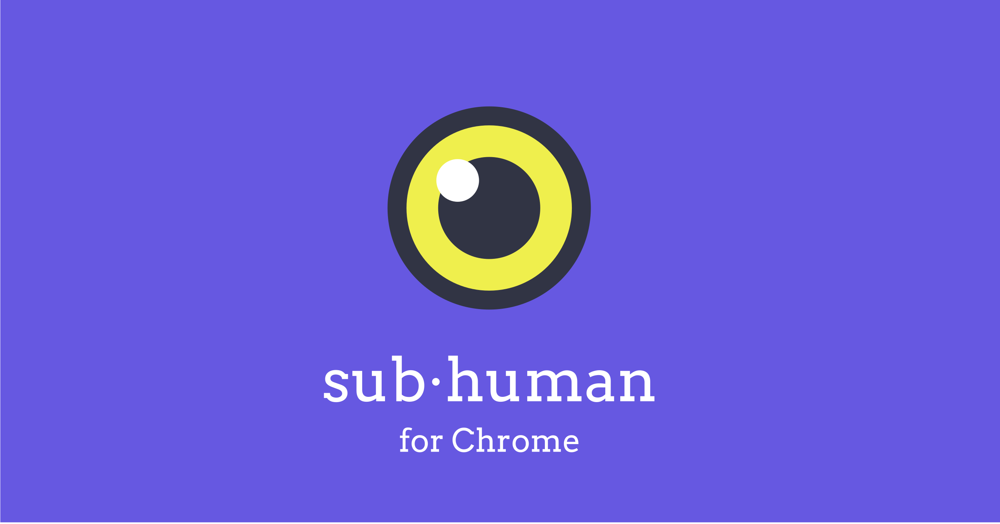

# sub  human

For every other human who doesn't like to be tracked.

### Disclaimer

I am not responsible for any actions and consequences from using this app. It is just available to you. It is your choice to use it so think carefully.

## What

This is a Chrome extension app that tracks and exposes in-browser tracking pixels or pixel tags common deployed by marketing emails known as **read receipts**.

It gives you simple options to:

+ Block all images
+ Expose the pixel tracker
+ Send DOS-like repetive requests to the source.

### Block

Blocks all requests to image automatically. This is just an afterthought. There are probably better serious alternatives out there.

### Expose

The extension finds a suspicious `` with width and height of 1 and swap it with a hovering drone sentinel so you can see it right away.

### Retaliate

Uses a pool of [Web Workers](https://developer.mozilla.org/en-US/docs/Web/API/Web_Workers_API/Using_web_workers) to repetively fetch the pixel trackers from the source's server. If the pixel tracker was used as a read receipt, it would likely appear as if you opened the mail hundreds of times.

## Build

To build from this repo, follow [this guide](https://developer.chrome.com/extensions/getstarted) to load from unpack directory. You can load from `/src` after running `yarn install` to download its dependencies or run `./dist.py` which will minify the JavaScript and install all dependencies into `/dist`.

## FAQs

+ Is the retaliation aka DDoS attacks (Computer Misuse Act of 1990)?

  > The service isn't likely going to go down with just a user spinning off a bunch of Web Workers to fetch the same images over and over. To [quote Mike Davidson](https://twitter.com/mikeindustries/status/1148780494093348864), "...It’s more of a Denial Of Cheapness attack."
  >
  > An interesting question to ask might be "Why is a user sending requests repetitively to fetch the very same image a corporation has sent to track her without her consent be illegal?"

+ Is this available to install from Chrome web store?

  > It is pending review and probably won't get approved. However, anyone can definitely [load the extension and use it locally](#build).

+ Why Chrome? Any plan to support other browsers or platform?

  > Because most people use Chrome, thus they are more vulnerable. Most people who decided not > to use Chrome are quite aware of their privacy anyway.

+ Is this an attempt at internet's *[Révolution française](https://en.wikipedia.org/wiki/French_Revolution)*?

  > Well, that's not coming from me. But imagine millions of users with a click of a button can anytime orchestrate to take down or halt a corporation's service together at the same time. Isn't that interesting from a democratic point of view?

## Milestones

Not in this order:

+ Better Web Workers optimization
+ Distributed server-side attacks
+ Options to choose image substitution
+ Better attack animation